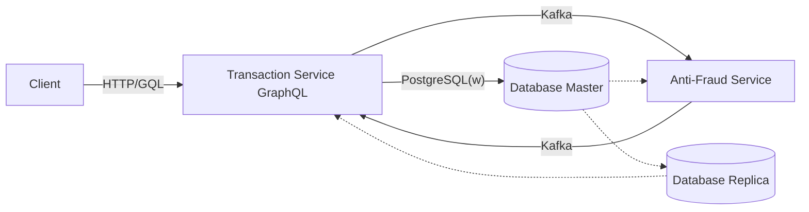

# Proyecto Yape Code Challenge

## Introducción
Este proyecto implementa un sistema de manejo de transacciones financieras con una arquitectura de microservicios utilizando Docker, PostgreSQL, Kafka, y Node.js. El sistema asegura que cada transacción sea validada por un microservicio de antifraude antes de actualizar su estado. Se utiliza GraphQL para exponer una interfaz API consistente y flexible, permitiendo la creación y consulta de transacciones de manera eficiente.

## Arquitectura
La arquitectura está dividida en varios servicios, incluyendo:
- **transaction-service**: Microservicio para la creación y recuperación de transacciones.
- **antifraud-service**: Microservicio para la validación de transacciones.

Cada uno de estos servicios se comunica a través de Kafka, lo que permite un procesamiento eficiente y desacoplado de los eventos de transacciones. Los servicios exponen endpoints GraphQL para interactuar con ellos. Además, se implementa una configuración de base de datos PostgreSQL con replicación, donde una base de datos actúa como principal para operaciones de escritura y la otra como réplica para operaciones de lectura, asegurando así alta disponibilidad y escalabilidad.

### Diagrama de la Arquitectura

Este diagrama muestra cómo los servicios interactúan a través de Kafka y cómo el estado de las transacciones se almacena y se recupera de PostgreSQL.

## Configuración del Entorno

### Pre-requisitos
- Docker
- Docker Compose
- Node.js

### Instrucciones de Configuración
1. **Construir y ejecutar los servicios con Docker Compose**
   ```bash
   docker-compose up --build
   ```
   Este comando construirá y levantará todos los servicios definidos en `docker-compose.yml`, incluidos los servicios de base de datos, Kafka y los microservicios.

2. **Verificar que los servicios están funcionando**
   Acceder a `http://localhost:3031/graphql` para visualizar la interfaz de consulta de GraphQL donde puedes ver la documentación y generar consultas.

## Uso del Sistema con GraphQL

### Crear una Transacción
Utiliza una mutación GraphQL para crear una nueva transacción financiera. Aquí tienes un ejemplo de cómo enviar la mutación:
```graphql
mutation {
  createTransaction(
    createTransactionInput: {
      accountExternalIdDebit: "470d3318-e8ad-4668-bb5d-c18e9c48f521",
      accountExternalIdCredit: "7c032778-cdfc-4b4c-b354-67cd93c79468",
      transferenceTypeId: 2,
      value: 1000
    }
  ) {
    transactionExternalId
    transactionStatus
    transferenceTypeId
    accountExternalIdDebit
    accountExternalIdCredit
    value
    createdAt
  }
}
```

**Ejemplo de respuesta:**
```json
{
  "data": {
    "createTransaction": {
      "transactionExternalId": "898dd126-7665-4a45-90ae-df985ad2429b",
      "transactionStatus": "pending",
      "transferenceTypeId": 2,
      "accountExternalIdDebit": "470d3318-e8ad-4668-bb5d-c18e9c48f521",
      "accountExternalIdCredit": "7c032778-cdfc-4b4c-b354-67cd93c79468",
      "value": 1000,
      "createdAt": "2024-06-04T20:45:59.574Z"
    }
  }
}
```

### Recuperar una Transacción
Para obtener detalles de una transacción específica mediante su ID, utiliza la siguiente consulta GraphQL:
```graphql
query {
  findTransactionById (
    transactionExternalId:"898dd126-7665-4a45-90ae-df985ad2429b"
  ) {
    transactionExternalId
    transferenceType {
      name
    }
    transactionStatus {
      name
    }
    value
    createdAt
  }
}
```

**Ejemplo de respuesta:**
```json
{
  "data": {
    "findTransactionById": {
      "transactionExternalId": "898dd126-7665-4a45-90ae-df985ad2429b",
      "transferenceType": {
        "name": "Withdrawal"
      },
      "transactionStatus": {
        "name": "approved"
      },
      "value": 1000,
      "createdAt": "2024-06-04T20:45:59.574Z"
    }
  }
}
```

## Testing
Para ejecutar los tests del `antifraud-service`:
```bash
docker-compose exec antifraud-service yarn test
```
Este comando ejecuta todos los tests definidos en el servicio de antifraude.
